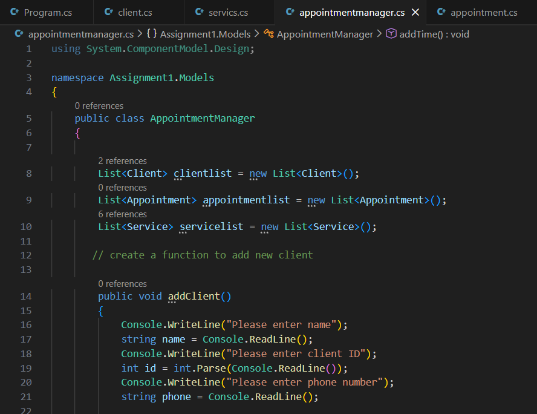

# http5125-Back-End
Class content from Back-End Web Development

***HTTP5121 - Back-End Web Development*** is a class primarily focuses on learning to code in C#.

[C#](https://www.w3schools.com/cs/index.php)

> Week 5



> Week 4

```while (true)
        {
            
            for(int i =0; i < program_.glasses.Count; i++)
        {
            Console.WriteLine("Glasses Shopping");
            Console.WriteLine(i+1 + " Brand " + program_.glasses[i].name + "\n" + " Price " + program_.glasses[i].price + "\n" + " Detail: " + program_.glasses[i].description);
            
        }
        Console.Write("Pick your number of item: " + "\n");
        Console.WriteLine("Put 0 to Checkout");
        
        UserInput = int.Parse(Console.ReadLine());
        }
```
